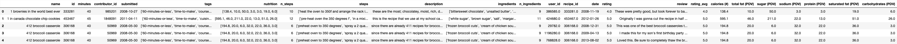

# Are Complicated Recipes Unhealthy and Boring?

**Name**: Brian Liu

## Introduction
The dataset used in this project is the **Recipes and Ratings** dataset, which nominally contains 83,782 recipes and 731,927 interactions (reviews and ratings) from Food.com. After preprocessing, there are 234,429 rows. This project focuses on understanding how recipe complexity relates to nutritional value and user ratings.

**Research Question**: *What is the relationship between a recipe's complexity (steps, time, ingredients) and its nutritional value, and can these factors be used to accurately predict user satisfaction (average ratings)?*

**Significance**: This analysis investigates the "return on investment" for home cooking. We explore whether "complex" recipes (more steps, longer time) are necessarily more calorie-dense or higher-rated than simple ones. By building a model to predict ratings from complexity and nutrition, and assessing its fairness across short and long recipes, we aim to understand what affects user satisfaction for recipes.

**Relevant Columns**:
- `n_steps`: The number of steps required to make the recipe (i.e. how complex a given recipe is).
- `minutes`: The time it takes to prepare the recipe.
- `rating_avg`: The average rating (1-5 stars) given by users for a given recipe.
- `nutrition`: A list of nutritional values (calories, fat, sugar, etc.), out of which calories, total fat, sugar, and protein columns were extracted.
- `calories (#)`: The number of calories per serving (extracted from `nutrition`).
- `sugar (PDV)`: The sugar content (PDV) (extracted from `nutrition`).
- `total fat (PDV)`: The total fat content (PDV) (extracted from `nutrition`).
- `protein (PDV)`: The protein content (PDV) (extracted from `nutrition`).

## Data Cleaning and Exploratory Data Analysis
### Data Cleaning
To prepare the data for analysis, we performed the following cleaning steps:

1.  We left-merged the `recipes` dataset (containing recipe metadata) with the `interactions` dataset (containing user reviews) on `recipe_id`. This allows us to link recipe features (like steps) with user feedback (ratings).
2.  We replaced `rating` values of `0` with `NaN`. In this dataset, a rating of 0 indicates that a user did not provide a numeric rating (often just a comment), not that they gave it a "zero star" review (the scale is 1-5). Treating 0 as a valid low score would severely skew the average ratings downwards incorrectly.
3.  We grouped the merged data by recipe `id` and calculated the mean of the `rating` column, storing it as `rating_avg`. This gives us a single target variable per recipe.
4.  The `nutrition` column contained string representations of lists (e.g., `"[51.5, 0.0, ...]" `). We parsed these strings into actual lists and expanded them into separate columns: `calories`, `total fat`, `sugar`, `sodium`, `protein`, `saturated fat`, and `carbohydrates`. This allows us to analyze specific nutritional components directly.

**Cleaned Data Head**:

### Univariate Analysis
<iframe src="assets/univariate_1.html" width="800" height="600" frameborder="0"></iframe>
*Description: The distribution of average ratings is left-skewed, with most recipes receiving high ratings (4-5 stars).*

### Bivariate Analysis
<iframe src="assets/bivariate_1.html" width="800" height="600" frameborder="0"></iframe>
*Description: There is a positive correlation between the number of steps and calories. More complex recipes tend to have more calories, although there is significant variance.*

<iframe src="assets/bivariate_2.html" width="800" height="600" frameborder="0"></iframe>
*Description: The relationship between saturated fat and rating is not very strong, but there is a slight trend where recipes with moderate saturated fat are rated highly. Extremely high fat content doesn't necessarily guarantee a better rating.*

### Interesting Aggregates
#### Average Recipe Calories, Sugar, and Total Fat per Recipe Complexity (Based on # of Steps)
This table reveals a clear trend: as recipe complexity increases (more steps), the nutritional content (calories, sugar, and fat) also increases. "Very High" complexity recipes have nearly double the calories of "Low" complexity ones. This suggests that more effort in the kitchen often correlates with richer, heavier meals (like elaborate desserts or main courses), whereas simpler recipes might be lighter snacks or quick meals.

| complexity_level (n_steps)  |   calories (#) |   sugar (PDV) |   total fat (PDV) |
|:-------------------|---------------:|--------------:|------------------:|
| Low (1-5)          |        315.745 |       59.7003 |           23.3981 |
| Medium (6-10)      |        397.962 |       59.3847 |           30.0082 |
| High (11-20)       |        480.02  |       66.5914 |           37.0473 |
| Very High (20+)    |        654.781 |       95.4448 |           51.343  |

## Assessment of Missingness
### NMAR Analysis
The `rating` column might be **NMAR** (Not Missing At Random). Users are often less likely to leave a rating when they feel indifferent about the recipe; they are motivated to rate only if they have a strong positive or negative experience. However, because this "indifference" is the unobserved value itself (or related to the unobserved rating), the missingness is NMAR. If we could collect additional data such as "user engagement time" or "did they verify cooking it", we might be able to explain the missingness, potentially making it MAR (Missing At Random) conditioned on those new columns.

### Missingness Dependency
We tested if the missingness of `rating` depends on the **number of steps** (`n_steps`).

- **Null Hypothesis**: The distribution of `n_steps` is the same when `rating` is missing vs. not missing.

- **Alternative Hypothesis**: The distribution of `n_steps` is different when `rating` is missing vs. not missing.

- **Test Statistic**: The absolute difference in means of `n_steps`.

- **Significance Level**: 0.05.

<iframe src="assets/missingness_nsteps.html" width="800" height="600" frameborder="0"></iframe>

**Results**:
- **Observed Statistic**: 1.34
- **P-value**: **< 0.001**
- **Conclusion**: Since the p-value is less than the significance level of 0.05, we **reject the null hypothesis**. There is strong evidence that the missingness of ratings depends on the `n_steps` column.

We also tested dependency on `minutes`.
- **P-value**: 0.108
- **Conclusion**: The p-value > 0.05, so we **fail to reject the null hypothesis**. We do not have sufficient evidence to say rating missingness depends on recipe preparation time.

## Hypothesis Testing
**Null Hypothesis**: Recipes with high complexity (10+ steps) and low complexity (<10 steps) have the same average caloric content.

**Alternative Hypothesis**: Recipes with high complexity (10+ steps) have a **higher** average caloric content than low complexity recipes. (One-sided).

**Test Statistic**: Difference in means (Mean Calories of High Complexity - Mean Calories of Low Complexity).

**Significance Level**: 0.05.

**Justification**: We chose difference in means because `calories` is a quantitative variable and we are comparing two groups. A permutation test is appropriate here as we are making no assumptions about the underlying distribution of calories.

**Results**:
- **Observed Difference**: 128.1 calories
- **P-value**: **< 0.001**
- **Conclusion**: Since the p-value is below 0.05, we **reject the null hypothesis**. The data suggests that more complex recipes indeed tend to be more calorie-dense.

## Framing a Prediction Problem
**Problem**: Predict the average rating of a recipe (`rating_avg`).

**Type**: **Regression**.

**Response Variable**: `rating_avg`. We chose this variable because we want to quantify user satisfaction on a continuous scale (1-5), and predicting the exact average allows for more granular recommendations.

**Evaluation Metric**: **RMSE** (Root Mean Squared Error). We chose RMSE over R^2 because RMSE provides an error metric in the same units as the rating (stars), which is more interpretable for this context. We want to know, on average, how many stars off our prediction is.

**Features Known at Prediction Time**: We only use features intrinsic to the recipe (steps, ingredients, nutrition, time) which are known *before* any users rate it. We do not use any user-interaction data (like number of reviews) as predictors.

## Baseline Model
**Model**: Linear Regression.

**Features**:
- `n_steps` (Quantitative): Used as is (standardized).
- `calories` (Quantitative): Used as is (standardized).

**Preprocessing**: We used a `StandardScaler` for both quantitative features to ensure they are on the same scale, which is standard practice for linear regression (though strictly not required for prediction performance, it helps with interpretation of coefficients). There were no categorical features in the baseline model.

**Performance**:
- **Train RMSE**: 0.4975
- **Test RMSE**: 0.4973
- The model performs adequately but simply assumes a linear relationship between complexity/calories and rating, which may be too simple. The RMSE of ~0.5 means we are off by half a star on average.

## Final Model
**Model**: Random Forest Regressor.

**Features**:
- `minutes` (Quantitative): Recipes taking longer might be rated differently (e.g. "Sunday roasts" vs "quick snacks"). We applied a `QuantileTransformer` to handle the heavy right skew of time data.
- `n_ingredients` (Quantitative): Another proxy for complexity. Standardized.
- `nutrition` features (fat, sugar, protein) (Quantitative): To capture the "health" aspect. Standardized.
- `calories_per_minute`(Transformed Quantitative): Calculated as `calories / (minutes + 1)`. This represents "energy density over time". It helps differentiate between high-calorie meals that take hours to cook (like a slow-roasted pork shoulder) versus high-calorie snacks that are quick (like a milkshake).
- `complexity_density` (Transformed Quantitative): Calculated as `n_steps / (minutes + 1)`. This represents "steps per minute". A high value indicates a very busy, intense cooking process (lots of steps in short time), whereas a low value might indicate a "set it and forget it" recipe (few steps over long time).

**Algorithm Choice**: A **Random Forest** model was chosen because it can capture non-linear relationships and interactions between features (e.g., highly complex recipes might only be rated highly if they are also high in fat/sugar).

**Hyperparameter Tuning**: We used `GridSearchCV` with 3-fold cross-validation. We tuned:
- `n_estimators` (Number of trees): [50, 100]. More trees generally improve stability and performance but increase computation.
- `max_depth` (Tree depth): [5, 10, 15]. Controlling depth helps prevent overfitting by limiting how specific the model can get to the training data.
- `min_samples_split` (Split criteria): [2, 5]. Higher values prevent the model from learning from too few samples (noise).

**Performance**:
- **Best Hyperparameters**: `max_depth=15`, `min_samples_split=2`, `n_estimators=100`.
- **Final Train RMSE**: 0.4180
- **Final Test RMSE**: 0.4555
- **Improvement**: The Final Model reduced the RMSE by approximately **0.0418 stars** compared to the Baseline.
- The baseline model essentially assumed that "more steps" or "more calories" directly and linearly lead to a specific rating. However, user satisfaction might be more accurately reflected in the **effort-to-reward ratio**. A user who spends 2 hours cooking a complex meal expects a gourmet result; if it's merely "okay", they might rate it harshly. Conversely, a user making a 5-minute snack sets the bar lower for complexity but higher for instant gratification.
  
  The engineered features capture this dynamic:
  1.  **`complexity_density` (`n_steps` / `minutes`)** represents the "stressfulness" of the cooking process. A recipe with 20 steps in 10 minutes is likely frantic and difficult to follow, leading to user frustration and lower ratings regardless of the taste. A recipe with 20 steps over 2 hours is a paced, "labor of love" project. By providing this ratio, the model can distinguish between "bad complexity" (confusion) and "good complexity" (craft).
  2.  **`calories_per_minute`** proxies "indulgence efficiency". Users often rate "guilty pleasures" (high-calorie, quick treats like cookies or milkshakes) very highly because the reward (taste/sugar) comes immediately with little effort. A high value here signals this specific category of "high-reward, low-effort" food that tends to generate enthusiastic 5-star ratings, a pattern the linear baseline missed completely.

## Fairness Analysis
**Question**: Does the model perform differently for **Short recipes** (< 30 min) vs. **Long recipes** (>= 30 min)?

**Group X**: Short recipes (`minutes` < 30).

**Group Y**: Long recipes (`minutes` >= 30).

**Evaluation Metric**: **RMSE**.

**Hypotheses**:
- **Null Hypothesis**: The model's RMSE is the same for both Short and Long recipes. (Any difference is due to chance).
- **Alternative Hypothesis**: The model's RMSE is different for Short and Long recipes. (Two-sided).
- **Significance Level**: 0.05.
- **Test Statistic**: Absolute Difference in RMSE.

<iframe src="assets/fairness_plot.html" width="800" height="600" frameborder="0"></iframe>

**Results**:
- **RMSE (Short)**: 0.4222
- **RMSE (Long)**: 0.4746
- **Observed Absolute Difference**: 0.0525
- **P-value**: **0.0**
- **Conclusion**: Since the p-value < 0.05, we **reject the null hypothesis**. The model is **unfair** with respect to recipe duration; it is significantly more accurate (lower RMSE) for short recipes than for long recipes. This might be because short recipes are simpler to rate or generally have less variance in quality.
